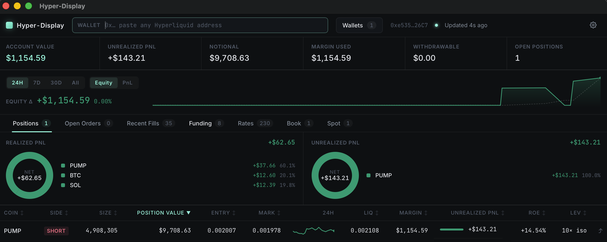
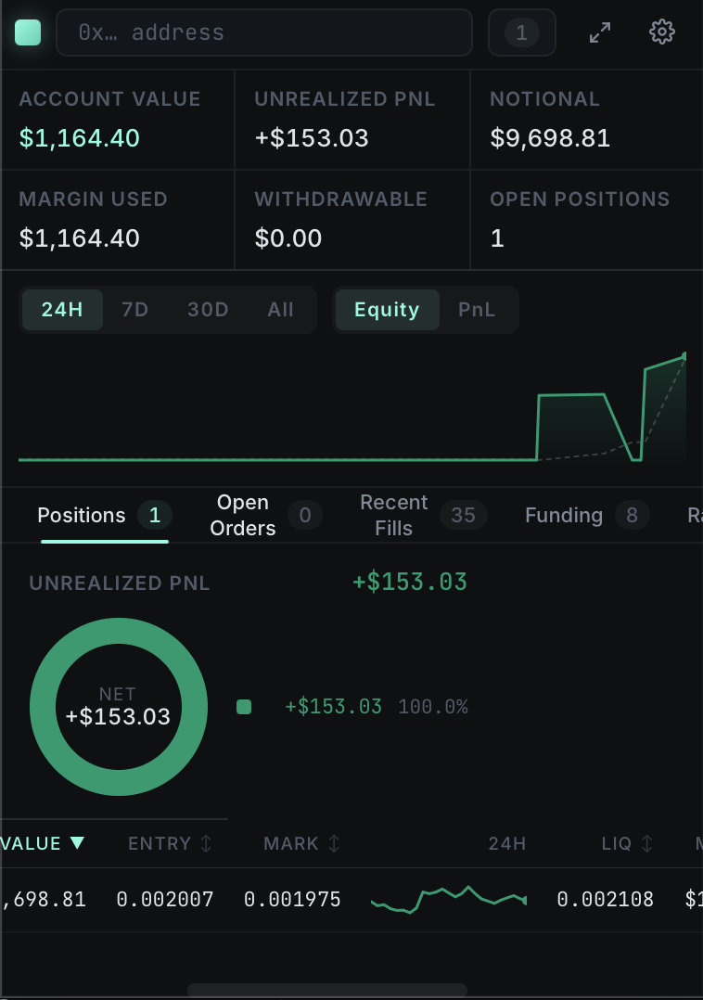
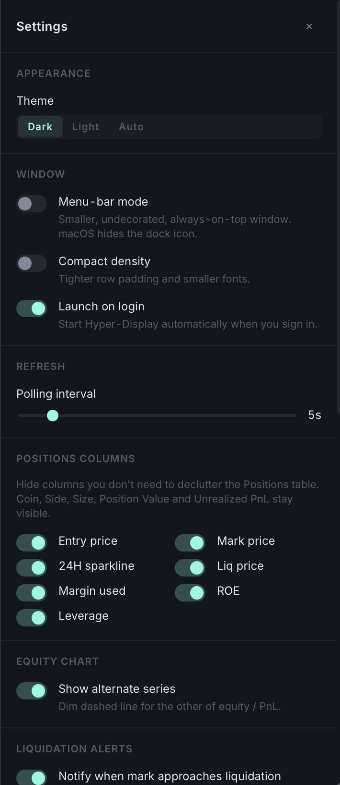

<div align="center">

# Hyper-Display

**Always-on Hyperliquid positions dashboard.**

A read-only desktop app that mirrors the Hyperliquid trading view for any wallet you paste. Pin it on a second monitor, drop it into your menu bar, and let it update live in the background.

[](LICENSE)
[](https://tauri.app)
[](https://hyperliquid.gitbook.io/hyperliquid-docs/for-developers/api/info-endpoint)
[](https://github.com/ramenxbt/hyper-display/releases)

<br />



</div>

## Why

The Hyperliquid web app is great when you are actively trading, but it is heavy to keep open all day, and it only shows the wallet you are currently connected with. Hyper-Display is the opposite: a lightweight native window that watches any address you paste, refreshes every five seconds by default, and stays out of the way.

Use it for:

- Watching your own positions while you work in another window.
- Tracking a friend, a fund, or a vault that publishes its address.
- Studying a wallet's live behavior without giving any platform your own keys.

It is **read-only by design**. No keys, no signatures, no servers. Just the public Hyperliquid info API and your own machine.

## Features

### Live data
- Account summary: account value, unrealized PnL, notional, margin used, withdrawable, open position count.
- Positions table with size, entry, mark, liq price, margin, unrealized PnL, ROE, leverage, an inline 24H mark sparkline, and a per-position uPnL contribution bar.
- Open orders, recent fills, and 30-day funding payments tables, all with sortable headers, a per-coin filter, and CSV export.
- Realized + unrealized PnL donuts above the Positions table, sliced by coin.

### Insights
- Funding-rate heatmap covering every Hyperliquid coin, color-coded by 1H rate with annualised APR.
- Star coins to a watchlist and trigger alerts when their |rate| crosses a threshold.
- Order-book depth panel with bid / ask ladders, cumulative depth bars, best-bid / ask, and spread (price + bps).
- Spot balances tab (read-only): available / on-hold / entry notional per token.

### Workflow
- Multi-wallet presets with custom labels, notes, and `⌘1..9` / `Ctrl+1..9` hotkeys.
- Aggregate view: one virtual "All wallets" entry sums every saved wallet (`⌘0`). Tables tag each row with the originating wallet.
- Equity sparkline strip with 24H / 7D / 30D / All toggle and an Equity-vs-PnL series switch.
- Command palette (`⌘K`) over wallets, tabs, coins, theme, and quick actions.
- Light, Dark, and Auto theme.

### Always-on
- Menu-bar tray icon with click-to-toggle and a Show / Hide / Quit menu.
- Menu-bar mode: small, undecorated, always-on-top window. macOS hides the dock icon (`ActivationPolicy::Accessory`).
- Tray-anchored window position so the menu-bar window appears under the icon.
- Click the ⤴ on any Positions row to spawn a small always-on-top floating mini-window of just that coin. Pin layout (size + position) is persisted across launches.
- Compact density mode for a denser layout (auto-on in menu-bar mode).
- Auto-launch on login (macOS / Windows / Linux) via `tauri-plugin-autostart`.

### Alerts
- Liquidation-proximity desktop notifications with configurable threshold and per-coin 30-minute throttle.
- Custom alert rules: total uPnL above / below thresholds, watchlisted coin funding-rate above %.
- Webhook mirror to Discord, Slack, or generic JSON endpoints.

### Quality of life
- Backup: one-click export / import of saved wallets and settings as a single JSON file. Drop it in iCloud, Drive, or Dropbox to sync.
- Configurable Positions columns.
- Persisted last-used wallet, refresh interval (2 to 30s), and theme.

## Screenshots

### Full dashboard

The Positions tab with realized + unrealized PnL donuts (sliced by coin), the equity sparkline strip with 24H / 7D / 30D / All toggle, and the live positions table.

<p align="center">
  
</p>

### Menu-bar mode and Settings

Left: collapses to a small always-on-top window with the dock icon hidden, anchored under the tray icon. Right: settings panel with theme, polling interval, column visibility, alerts, webhook, and backup.

<p align="center">
  
  &nbsp;&nbsp;
  
</p>

## Install

Hyper-Display is a regular desktop app. Pick your platform, click the matching link on the [latest release page](https://github.com/ramenxbt/hyper-display/releases/latest), open the downloaded file. That's it.

> The pre-v1.0 binaries are **not signed**. macOS Gatekeeper and Windows SmartScreen will warn you on first launch. Each section below has a one-step bypass.

<details open>
<summary><b>🍎 macOS (Apple Silicon and Intel)</b></summary>

1. On the [latest release](https://github.com/ramenxbt/hyper-display/releases/latest) page, download the `.dmg` whose name matches your Mac:
   - Apple Silicon (M1/M2/M3/M4): the file ending in `aarch64.dmg`.
   - Intel: the file ending in `x64.dmg`.
2. Open the `.dmg` and drag **Hyper-Display** into your **Applications** folder.
3. Open Applications, **right-click Hyper-Display, choose Open**, then click **Open** in the dialog. (You only do this once. After that, just double-click like any other app.)

If you see "Hyper-Display.app is damaged and can't be opened" instead of the right-click dialog, run this once in Terminal:

```bash
xattr -dr com.apple.quarantine /Applications/Hyper-Display.app
```

That removes the quarantine flag macOS attaches to unsigned downloads.

**One-line install** (Apple Silicon and Intel) using the helper script:

```bash
curl -fsSL https://raw.githubusercontent.com/ramenxbt/hyper-display/main/install.sh | bash
```

The script picks the right `.dmg`, downloads it, and opens the installer.

</details>

<details>
<summary><b>🪟 Windows 10 / 11</b></summary>

1. On the [latest release](https://github.com/ramenxbt/hyper-display/releases/latest) page, download the file ending in `x64-setup.exe` (NSIS installer) or `x64_en-US.msi` (MSI). Either works; `.exe` is friendlier.
2. Double-click the downloaded file.
3. Windows Defender SmartScreen will pop up because the binary is unsigned. Click **More info → Run anyway**.
4. Follow the installer (Next → Next → Finish).

After install, search for **Hyper-Display** in the Start menu.

</details>

<details>
<summary><b>🐧 Linux (Debian / Ubuntu / Fedora / others)</b></summary>

The release ships three artifacts for Linux. Pick whichever fits your distro:

| Format | When to use it |
| --- | --- |
| `.AppImage` | Works on every modern distro. No install needed: `chmod +x` and double-click. |
| `.deb` | Debian, Ubuntu, Pop!\_OS, Mint. `sudo apt install ./hyper-display_*.deb` |
| `.rpm` | Fedora, RHEL, openSUSE. `sudo rpm -i hyper-display-*.rpm` |

**One-line install** (AppImage into `~/.local/bin`):

```bash
curl -fsSL https://raw.githubusercontent.com/ramenxbt/hyper-display/main/install.sh | bash
```

</details>

If your platform isn't in the release assets yet (we ship arm64 macOS, x64 macOS, x64 Windows, x64 Linux), see **Build from source** below.

## Build from source

### 1. Install prerequisites

You need three things on every platform: a C/C++ toolchain, the Rust toolchain, and Node.js 20 or newer.

<details>
<summary><b>macOS (Apple Silicon or Intel)</b></summary>

```bash
# Xcode Command Line Tools (provides the macOS C/C++ toolchain)
xcode-select --install

# Rust toolchain
curl --proto '=https' --tlsv1.2 -sSf https://sh.rustup.rs | sh

# Node.js 20+ (Homebrew shown; nvm or asdf work too)
brew install node
```

After installing Rust, restart your shell or run `source "$HOME/.cargo/env"`.

</details>

<details>
<summary><b>Windows 10 / 11</b></summary>

1. Install **Microsoft C++ Build Tools** (or full Visual Studio 2022) with the *Desktop development with C++* workload: <https://visualstudio.microsoft.com/visual-cpp-build-tools/>
2. Install **WebView2 Runtime** (already present on Windows 11; on 10 grab the Evergreen Bootstrapper from <https://developer.microsoft.com/microsoft-edge/webview2/>).
3. Install **Rust** with `rustup-init.exe` from <https://www.rust-lang.org/tools/install>.
4. Install **Node.js 20+** from <https://nodejs.org/> or via `winget install OpenJS.NodeJS.LTS`.

</details>

<details>
<summary><b>Linux (Debian / Ubuntu)</b></summary>

```bash
sudo apt update
sudo apt install -y \
  libwebkit2gtk-4.1-dev \
  build-essential \
  curl wget file \
  libxdo-dev \
  libssl-dev \
  libayatana-appindicator3-dev \
  librsvg2-dev

# Rust toolchain
curl --proto '=https' --tlsv1.2 -sSf https://sh.rustup.rs | sh

# Node.js 20+ via nvm
curl -o- https://raw.githubusercontent.com/nvm-sh/nvm/v0.40.0/install.sh | bash
source ~/.bashrc
nvm install 20
```

For Fedora, Arch, and other distros see the [Tauri prerequisites doc](https://tauri.app/start/prerequisites/#linux).

</details>

### 2. Clone, install, run

```bash
git clone https://github.com/ramenxbt/hyper-display.git
cd hyper-display
npm install
npm run tauri:dev
```

The first `tauri:dev` compiles the Rust shell from cold. Expect 2 to 5 minutes depending on machine. Subsequent launches start in seconds. The frontend has hot reload, so edits to TypeScript / CSS show up live.

### 3. Build a distributable bundle

```bash
npm run tauri:build
```

Output paths:

| Platform | Output |
| --- | --- |
| macOS | `src-tauri/target/release/bundle/macos/Hyper-Display.app` and `bundle/dmg/Hyper-Display_0.9.0_<arch>.dmg` |
| Windows | `src-tauri/target/release/bundle/msi/Hyper-Display_0.9.0_x64_en-US.msi` and `bundle/nsis/Hyper-Display_0.9.0_x64-setup.exe` |
| Linux | `src-tauri/target/release/bundle/deb/hyper-display_0.9.0_amd64.deb`, `bundle/appimage/hyper-display_0.9.0_amd64.AppImage`, `bundle/rpm/...` |

Pre-v1.0 builds are unsigned. macOS will block the first launch with Gatekeeper. To open it anyway, right-click the `.app` and choose **Open**, then click **Open** in the dialog.

## Usage

1. Launch the app.
2. Paste any Hyperliquid wallet address into the input at the top of the window.
3. The dashboard starts streaming. Save the wallet from the **Wallets** menu so it sticks across sessions.

### Keyboard shortcuts

| Shortcut | What it does |
| --- | --- |
| `⌘K` / `Ctrl+K` | Open the command palette |
| `⌘,` / `Ctrl+,` | Toggle the settings panel |
| `⌘1` to `⌘9` / `Ctrl+1..9` | Switch to saved wallet 1 through 9 |
| `⌘0` / `Ctrl+0` | Switch to the aggregate "All wallets" view |
| `Esc` | Close any open modal |

### Settings panel highlights

- **Window**: menu-bar mode, compact density, launch on login.
- **Appearance**: dark / light / auto theme.
- **Refresh**: polling interval slider (2 to 30 seconds).
- **Equity chart**: dim dashed alternate series toggle.
- **Positions columns**: hide entry, mark, 24H sparkline, liq, margin, ROE, leverage individually.
- **Custom alert rules**: total uPnL above / below thresholds, funding-rate alerts.
- **Webhook mirror**: Discord, Slack, or generic JSON URL.
- **Backup**: export / import everything as JSON.

## Architecture

```
src/
  components/      UI components (tables, donuts, sparkline, palette, settings)
  hooks/           polling hooks: useAggregateSnapshot, useMarkCandles, useFundingRates,
                   useL2Book, useLiqAlerts, useUpnlAlerts, useFundingAlerts, useSort
  lib/             Hyperliquid client, formatters, settings, wallets, aggregate, csv,
                   webhook, watchlist, pinLayout, backup
  App.tsx          top bar, summary, equity strip, tabs
  main.tsx         renders App or PinView based on URL params

src-tauri/         Rust shell, window config, tray icon, set_menubar_mode +
                   open_pin_window commands, autostart + notification plugins
```

The frontend talks to the public Hyperliquid info endpoint (`https://api.hyperliquid.xyz/info`) directly via `fetch`. There is **no Rust-side API code**: the Tauri shell only owns the window, the tray, and a couple of OS integrations. That keeps the project portable. You can run the same UI as a regular web app by deleting `src-tauri/` and pointing Vite at any static host.

### Hyperliquid endpoints used

| Request type | Returns |
| --- | --- |
| `clearinghouseState` | margin summary + asset positions |
| `frontendOpenOrders` | resting limit orders and triggers |
| `userFills` | recent fills, including closed PnL |
| `allMids` | live mid prices for every traded asset |
| `portfolio` | account-value and PnL history per timeframe |
| `userFunding` | hourly funding payments over the lookback |
| `candleSnapshot` | OHLCV candles for inline sparklines |
| `metaAndAssetCtxs` | universe-wide funding rates and mark prices |
| `l2Book` | bid / ask ladder for the order-book panel |
| `spotClearinghouseState` | spot balances per token |

See the [Hyperliquid info API reference](https://hyperliquid.gitbook.io/hyperliquid-docs/for-developers/api/info-endpoint) for full schemas.

## Privacy and data

Hyper-Display never sees your keys. It only ever issues `POST` requests to the public Hyperliquid info endpoint with the address you paste in. Your last address, saved wallets, settings, and pin layout are stored in `localStorage` on your own machine. Nothing is sent anywhere else.

The only outbound network calls beyond Hyperliquid are:

- Fonts: Inter and JetBrains Mono are loaded from Google Fonts at app start.
- Notifications: native OS only.
- Webhook mirror: only fires if you configure it, only to the URL you provide.

## Roadmap

Planned for v1.0 (first stable release pass):

- App icon set and signed macOS DMG / Windows MSI artifacts.
- Onboarding overlay for first-time launch.
- Diagnostics screen (data-source latencies, last-error log).
- Polished website with screenshots and a download CTA.

See [`CONTRIBUTING.md`](CONTRIBUTING.md) if you would like to help ship any of those.

## Contributing

PRs are welcome. The setup is the same as **Build from source** above. See [`CONTRIBUTING.md`](CONTRIBUTING.md) for the workflow, style guide, and what kind of changes land easiest.

## License

MIT. See [LICENSE](LICENSE).

Built by [@ramenxbt](https://github.com/ramenxbt). Not affiliated with Hyperliquid.
